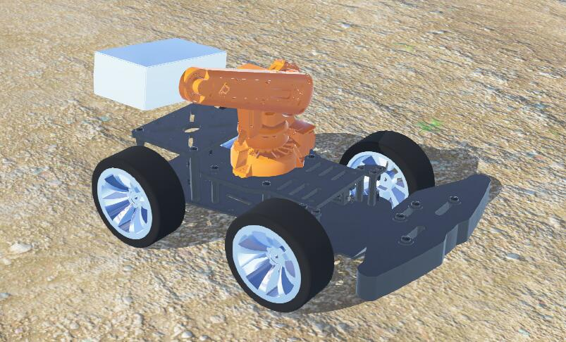

# Mihotel

Mihotel Project Document.

  

### [📊 View our ZenHub Workspace](https://app.zenhub.com/workspaces/mihotel-5e5b3461c9cab6f18ca30973/board?repos=243200095)

### [🌏 View our patio interactively](http://q98gml03z.bkt.clouddn.com/patio.html)

### [🎥 View our simulation interactively]() (TODO)

---
Table of Contents
1. [✔️ Highlights](#️-Highlights)
2. [⚠️ Precautions](#️-Precautions)
3. [Known Problems](#Known-Problems)
4. [Configurations](#Configurations)
5. [🔍 Output Description](#-Output-Description)
6. [Solution (WIP)](#Solution-WIP)
   1. [System](#System)
      1. [Structure](#Structure)
      2. [ANSI codes in webots console](#ANSI-codes-in-webots-console)
   2. [Chassis](#Chassis)
   3. [Visual & Sensor](#Visual--Sensor)
   4. [Decision](#Decision)
7. [Development Strategy](#Development-Strategy)
8. [Personnel Division](#Personnel-Division)
9. [Project Specifications](#Project-Specifications)
10. [Tasks](#Tasks)
   1. [Task1](#Task1)
   2. [Task2](#Task2)
   3. [Task3](#Task3)
   4. [Task4](#Task4)
   5. [Task5](#Task5)
11. [报销流程及要求](#报销流程及要求)
12. [支出信息公开](#支出信息公开)

---

## ✔️ Highlights

- Fulfill all requirements
- good and fancy format of slides and report earns points
- notice content organization of slides and report, may need to discuss the
  content by hardware and software even if in a module
- Slides and report should be intuitive, beautiful, clear tables and schematic
  diagram are welcome

## ⚠️ Precautions

- Consider purchasing spare parts when buying vulnerable components
- focus on project progress
- we should get most design done until week 9. Because we **need to leave time
  for mid-term review**, we need to avoid week 11-13 (or even earlier). However
  demo video is needed in week 15, which means there's only 2 weeks left after
  week 9...
- be care of team communication and convergence
- need more hang outs 🍻

## Known Problems

- It seems that webots does not support a multiprocessing controller, since I did not find a way to stop all child processes when simulation is paused.

## Configurations

List of tools, modules with their version

| Item                                            | Argument      | Notes                                                        |
| ----------------------------------------------- | ------------- | ------------------------------------------------------------ |
| Simulation                                      | Webots R2020b | we are using a **very new** version of [Webots Nightly Build (24-4-2020)](https://github.com/cyberbotics/webots/releases/tag/nightly_24_4_2020) |
| Python                                          | 3.7.4         |                                                              |
| numpy                                           | 4.2.0.32      | Numpy module for python                                      |
| opencv-contrib-python                           | 4.2.0.32      | OpenCV module for python                                     |
| [colorama](https://github.com/tartley/colorama) |               | python module for colored terminal text                      |

## 🔍 Output Description

| Style         | prefix     | Description                                                  |
| ------------- | ---------- | ------------------------------------------------------------ |
| Bright Green  | [Info]     |                                                              |
| Bright Red    | [Debug]    | debug information, the difference against info is that, this should not show up unless is debugging |
| Bright Blue   | [Command]  | command given to chassis                                     |
| Bright Yellow | [Detected] | detect of object                                             |

## Solution (WIP)

### System

#### Structure

Since it seems that webots does not support controller with multiple processes, we have  to make a one process controller.

#### ANSI codes in webots console

see [here](https://github.com/cyberbotics/webots/blob/develop/docs/guide/controller-programming.md#console-output) for document.

### Chassis

The **chassis** of the rover is size of **15cm*45cm**, with wheels which diameter is **10cm**. The max speed of the rover is not decided yet. It is a **4WD** chassis, which mean speed of each wheel is separately defined.

The **feeding device** acts like a garbage truck dumping trash, we dump the kiwi by raising one side of the kiwi holder to let the kiwi slides down.

### Visual & Sensor

Our **line detector** works like this:

1. Filtering the original picture to denoise then get the gradient distribution of the picture.
2. Cut the whole picture into N rows averagely. (N=4 in current code)
3. For each segmentation of the picture, for each the point whose magnitude of gradient is greater than the threshold (15 in current code), classify them according to the direction of their gradient. (from 1° to 360°)
4. For each segmentation of the picture, find the direction which contains the most point whose magnitude of gradient exceed the threshold.
5. Average the direction of the N segmentation and it is the direction of the eage of the path. Rotate it by 90° and we could get the direction of the path.

### Decision

The **decision making** is still working in progress at [#46](https://github.com/TDPS-Mihotel/Mihotel/issues/46)

## Development Strategy

A regular automatic system development looks like this👇

But since **we don't have much experience** and **we don't have very long time**, we do it like this👇, start from the two green circles **at the same time**, which saves our time and gives us more chances to adjust the design.

## Personnel Division

- Tech Lead: [宋铸恒](https://github.com/LeoJhonSong)
- [Chassis](https://github.com/orgs/TDPS-Mihotel/teams/chassis): [王灏天](https://github.com/Howard2503) [王子建](https://github.com/Prince-JIAN) [史超凡](https://github.com/allensted)
- [Electrical](https://github.com/orgs/TDPS-Mihotel/teams/electrical)
  - [System Architecture](https://github.com/orgs/TDPS-Mihotel/teams/system): [宋铸恒](https://github.com/LeoJhonSong) [许瀚鹏](https://github.com/Laince20)
  - [Visual](https://github.com/orgs/TDPS-Mihotel/teams/visual): [文博](https://github.com/wb05025) [树畅](https://github.com/shuchang) [韩浩然](https://github.com/HandAdam)
  - [Decision](https://github.com/orgs/TDPS-Mihotel/teams/decision): [王子建](https://github.com/Prince-JIAN) [许瀚鹏](https://github.com/Laince20)
  - [Sensors and Peripheral Units](https://github.com/orgs/TDPS-Mihotel/teams/sensor): [韩浩然](https://github.com/HandAdam) [文博](https://github.com/wb05025)
- Environment: [褚进炜](https://github.com/LiamBishop) [熊汇雨](https://github.com/Xiong-Huiyu)
- [Document](https://github.com/orgs/TDPS-Mihotel/teams/document)
  - Slides: [熊汇雨](https://github.com/Xiong-Huiyu)
  - Demo Video: [王灏天](https://github.com/Howard2503)
  - Report: [树畅](https://github.com/shuchang) [熊汇雨](https://github.com/Xiong-Huiyu)
- [Project Manager](https://github.com/orgs/TDPS-Mihotel/teams/project-manager): [褚进炜](https://github.com/LiamBishop)

📑 [detail](doc/division.md)

## Project Specifications

First a homemade simulation environment, a.k.a. the patio is needed.

The required patio is shown below. Explicit labeled measurements can not be changed.

❗️ the green and red boxes are just for illustration, should not really appear.

| Item   | Measurement                          |
| ------ | ------------------------------------ |
| Rover  | maximum of 50x50 cm                  |
| Bridge | 100 cm wide, 3 m long                |
| Arch   | 100 cm wide, 100 cm high (suggested) |

## Tasks

### Task1

From the start point get to the first red box following the line.

💡 although there should not really be a red box, but can be set and measured by distance.

### Task2

Release a kiwi into the pond when the orange box is detected.

### Task3

Detect the bridge and go across it, the get to the right of the trees.

💡 Here a beacon could be used to avoid tree recognition.

### Task4

Detect the arch and get through it. Then follow the line to the color box.

### Task5

recognize color of the color box and follow the line in same color to the end.

💡 Color of the color box could be set manually.

## 报销流程及要求

学院对于本课程采取**凭发票报账报销政策**，需组员在购买过程中按照学院要求开具**增值税发票**.

具体报账要求详见 📑[**报账.md**](doc/报账.md)

## 支出信息公开

本栏目每周更新一次, 旨在进行**项目支出信息公开**.

具体支出明细详见 📑[**信息公开.md**](doc/信息公开.md)
