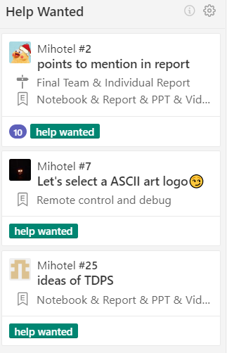

# Mihotel

Mihotel project document.

---
Table of Contents
- [Mihotel](#mihotel)
  - [✔️ Highlights](#%e2%9c%94%ef%b8%8f-highlights)
  - [⚠️ Precautions](#%e2%9a%a0%ef%b8%8f-precautions)
  - [Issues](#issues)
    - [Sensor](#sensor)
  - [Personnel Division](#personnel-division)
  - [项目内容](#%e9%a1%b9%e7%9b%ae%e5%86%85%e5%ae%b9)
    - [现场展示](#%e7%8e%b0%e5%9c%ba%e5%b1%95%e7%a4%ba)
    - [答辩](#%e7%ad%94%e8%be%a9)
    - [Patio 1](#patio-1)
      - [Task 1](#task-1)
      - [Task 2](#task-2)
      - [Task 3](#task-3)
    - [Patio 2](#patio-2)
      - [Task 1](#task-1-1)
      - [Task 2](#task-2-1)
      - [Task 3](#task-3-1)
  - [报销流程及要求](#%e6%8a%a5%e9%94%80%e6%b5%81%e7%a8%8b%e5%8f%8a%e8%a6%81%e6%b1%82)
  - [Tutorial on using Zenhub](#tutorial-on-using-zenhub)
    - [Basic structure of Zenhub](#basic-structure-of-zenhub)
      - [Workspace](#workspace)
        - [New Issues](#new-issues)
        - [Epics](#epics)
        - [Help Wanted](#help-wanted)
        - [In progress](#in-progress)
        - [Back Log](#back-log)
        - [Closed](#closed)
---

## ✔️ Highlights

- Fulfill all requirements
- good and fancy format of slides and report
- notice content organization of slides and report, may need to discuss the
  content by hardware and software even if in a module
- Slides and report should be intuitive, beautiful, clear tables and schematic
  diagram are welcome

## ⚠️ Precautions

- Consider purchasing spare parts when buying vulnerable components
- focus on project progress
- we should get most design done until week 9. Because we **need to leave time
  for mid-term review**, we need to avoid week 11-13 (or even earlier). However
  demo video is needed in week 15, which means there's only 2 weeks left after
  week 9...
- be care of team communication and convergence
- need more hang outs😏

## Issues

### Sensor

- there's metro pipe under the patio, geomagnetic sensor is greatly interfered
- image identification is affected much by light, ground wetness
  - insufficient light causes underexposure, too much light causes overexposure
  - color change of ground caused by rain may affect this

## Personnel Division

- Tech Lead: [宋铸恒](https://github.com/LeoJhonSong)
  - [Chassis](https://github.com/orgs/TDPS-Mihotel/teams/chassis): [王灏天](https://github.com/Howard2503) [王子建](https://github.com/Prince-JIAN) [史超凡](https://github.com/allensted)
  - [Electrical](https://github.com/orgs/TDPS-Mihotel/teams/electrical)
    - System Architecture: [宋铸恒](https://github.com/LeoJhonSong) [许瀚鹏](https://github.com/Laince20)
    - [Visual](https://github.com/orgs/TDPS-Mihotel/teams/visual): [文博](https://github.com/wb05025) [树畅](https://github.com/shuchang) [韩浩然](https://github.com/HandAdam)
    - [Decision](https://github.com/orgs/TDPS-Mihotel/teams/decision): [王子建](https://github.com/Prince-JIAN) [许瀚鹏](https://github.com/Laince20)
    - [Sensors and Peripheral Units](https://github.com/orgs/TDPS-Mihotel/teams/sensor): [韩浩然](https://github.com/HandAdam) [文博](https://github.com/wb05025)
  - [Document](https://github.com/orgs/TDPS-Mihotel/teams/document)
    - Slides: [熊汇雨](Xiong-Huiyu)
    - Demo Video: [王灏天](https://github.com/Howard2503)
    - Report: [树畅](https://github.com/shuchang) [熊汇雨](Xiong-Huiyu)
  - [Project Manager](https://github.com/orgs/TDPS-Mihotel/teams/project-manager): [褚进炜](https://github.com/LiamBishop)

📑 [detail](doc/division.md)

## 项目内容

项目为在东湖边两个露台展开的各三个任务. 下面简称露台1, 2的一系列任务为**p1**, **p2**.

### 现场展示

现场展示一个patio的过程.

### 答辩

答辩由`30分钟PPT` (p1p2内容都要包含, **demo视频时间算在这30分钟里**) 和`10分钟Q&A`组成

💡 30分钟看似很多, 但之前有些组是每个人都说几句所以讲到了**四十多分钟** (超时一些不要紧)

💡 demo视频视角完全由我们决定, 因此完全可以有遥控完成, 出错了就剪辑等操作

❗️ 虽然demo视频只需要一个, 但在答辩前几天才会知道抽中了哪个patio, 建议两个都做. (视频时间建议2-3min)

- 下列图示中`绿条`为一个任务的起始点
- `红条`为一个任务的终止点
- `粗绿条`和`粗红条`分别为一个patio的起始点和终止点
- `紫色标号`为一些小车需按顺序经过的点

💡 每个patio可以设置至多**两个**信标. 虽然问上一届信标本身没什么限制 (即可以考虑自制GPS), 建议用标定板做信标.

### Patio 1

#### Task 1

由`标号1`自主走到`标号6`

#### Task 2

在`标号7`处右转过小木桥, 木桥左边界 (照片视角) 对其对面台阶右边界.  `标号7`处考虑设置一个信标.

❗️ 木桥较窄 (约**0.45m**)而长 (约**2.2m**), 上桥前如果不调整好进入角度很有可能**中途掉落**.

#### Task 3

小车下桥后在遇到的第二条轨迹处 (`标号8`) 左转, 通过牌坊. `信标8`处考虑设置一个信标.

### Patio 2

#### Task 1

从起始点走到`标号1`, 识别此处的提示色块, 然后到达同色色块处.

💡 色块共有红, 绿, 蓝三种颜色.

#### Task 2

从任务1结束点以不违背总体要求的方式移动到斜槽处(`标号2`). 此处考虑使用两个信标或者利用花坛和水池. 然后将一开始携带的鱼食想法子弄到斜槽上.

❗️ `标号2`是这面栏杆从右数第二个这样的洞.

#### Task 3

到达`紫条`处, 发送包含以下信息的443MHz射频信号:

- 队名
- 队伍编号
- 当前时间 (24小时制)

❗️ 我后来确认了一下不是蓝牙信号, 但也只需要一个HC-12射频模块就可以了.

等待确认收到信息后继续前进到达`粗红条`处. (下图花坛处)

## 报销流程及要求

学院对于本课程采取**凭发票报账报销政策**，需组员在购买过程中按照学院要求开具**增值税发票**.

具体报账要求详见 📑[**报账.md**](doc/报账.md)

## Tutorial on using Zenhub

### Basic structure of Zenhub

#### Workspace
- ZenHub Workspaces are built using GitHub repositories. When a Workspace is created, each "card" on the Board represents a **GitHub Issue or Pull Request**.
- Move the cursor onto the **Workspace region** and slide the mouse wheel to **look through the tasks**.

##### New Issues
This workspace is created for **Newly created Issues** which requires to be done.

##### Epics
ZenHub Epics bundle **similar groups of Issues together**, providing a **visual progress bar** of work across related or dependent Issues. This panel can be regarded as a **group panel**, each group will have their own Epic panel containing their design tasks.

##### Help Wanted

The function of this workspace is exactly what it looks like. This panel contains the **problems which requires suggestions or solution from each member of Team Mihotel**.

##### In progress
This panel shows **what the team is currently working on**.

##### Back Log

- This panel contains the issues which **require to be solved immediately** or the **delayed ones**.

- The issues in Back-Log panel should **be placed by the order of their emergency levels**.

##### Closed

The **finished tasks** should be moved to this panel.

