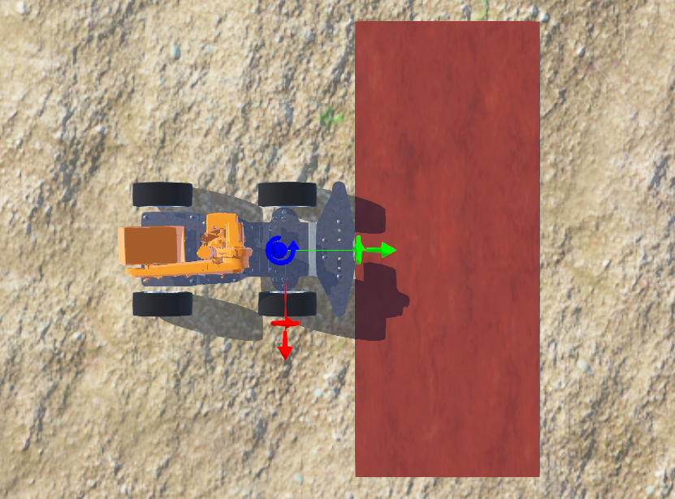
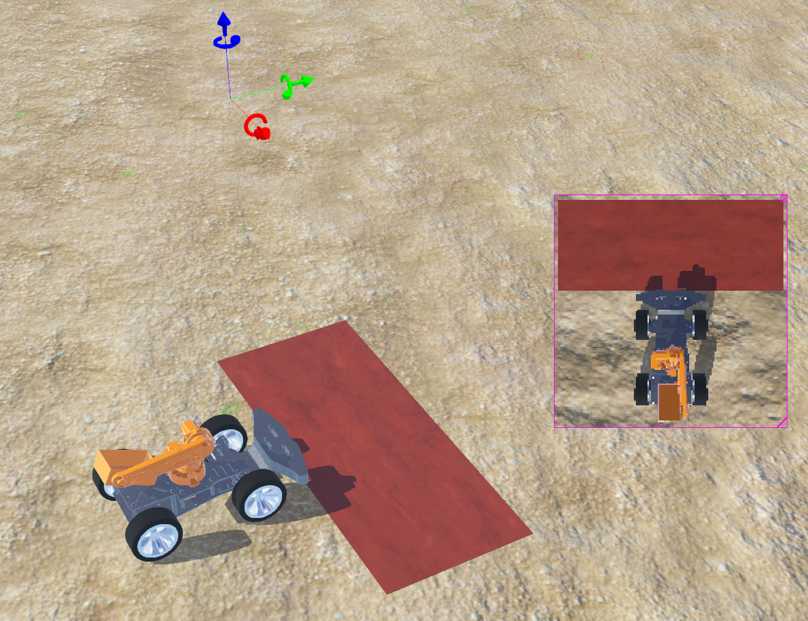
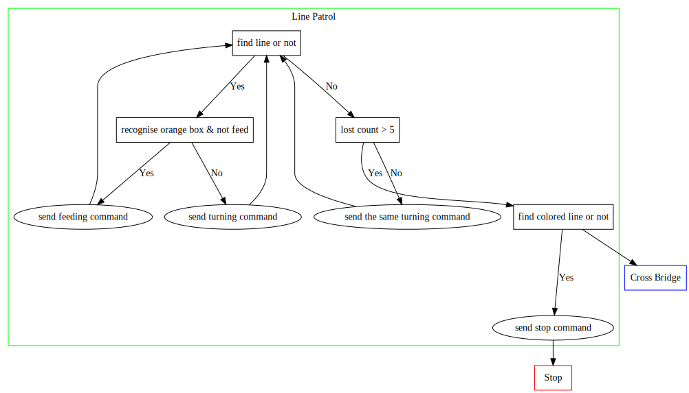

# Mihotel

Mihotel Project Document.

  

### [📊 View our ZenHub Workspace](https://app.zenhub.com/workspaces/mihotel-5e5b3461c9cab6f18ca30973/board?repos=243200095)

### [🌏 View our patio interactively](http://qanb2ovrg.bkt.clouddn.com/patio.html) (it may take seconds to load the model)

### [🎥 View our simulations](doc/simulation_list.md)

---
Table of Contents
- [✔️ Highlights](#️-Highlights)
- [⚠️ Precautions](#️-Precautions)
- [🐛 Known Problems](#-Known-Problems)
- [Configurations](#Configurations)
- [🔍 Output Description](#-Output-Description)
- [Solution (WIP)](#Solution-WIP)
  - [System](#System)
    - [Structure](#Structure)
    - [Communication](#Communication)
      - [Queue](#Queue)
      - [Shared variables](#Shared-variables)
    - [How it ends](#How-it-ends)
    - [ANSI codes in webots console](#ANSI-codes-in-webots-console)
    - [Keyboard event](#Keyboard-event)
  - [Chassis](#Chassis)
    - [Body](#Body)
    - [Wheels](#Wheels)
    - [Arm](#Arm)
  - [Visual & Sensor](#Visual--Sensor)
    - [Path Camera Parameters](#Path-Camera-Parameters)
  - [Decision](#Decision)
  - [Environment](#Environment)
    - [Specifications](#Specifications)
- [Development Strategy](#Development-Strategy)
- [Personnel Division](#Personnel-Division)
- [Project Specifications](#Project-Specifications)
- [Tasks](#Tasks)
  - [Task1](#Task1)
  - [Task2](#Task2)
  - [Task3](#Task3)
  - [Task4](#Task4)
  - [Task5](#Task5)
- [报销流程及要求](#报销流程及要求)
- [支出信息公开](#支出信息公开)

---

## ✔️ Highlights

- Fulfill all requirements
- good and fancy format of slides and report earns points
- notice content organization of slides and report, may need to discuss the
  content by hardware and software even if in a module
- Slides and report should be intuitive, beautiful, clear tables and schematic
  diagram are welcome

## ⚠️ Precautions

- Consider purchasing spare parts when buying vulnerable components
- focus on project progress
- we should get most design done until week 9. Because we **need to leave time
  for mid-term review**, we need to avoid week 11-13 (or even earlier). However
  demo video is needed in week 15, which means there's only 2 weeks left after
  week 9...
- be care of team communication and convergence
- need more hang outs 🍻

## 🐛 Known Problems

- It seems that webots does not support a multiprocessing controller, since I did not find a way to stop all child processes when simulation is paused.
- A few factors influent webots simulation speed:
  - factors listed by webots [here](https://cyberbotics.com/doc/guide/speed-performance)
  - number of complex sensors initialed
  - get value from sensors frequently
  - `basicTimeStep` in WorldInfo
  - time step of controller
  - output frequently
  - multiprocessing controller

- A few factors influent webots simulation precision:
  - factors listed by webots [here](https://cyberbotics.com/doc/guide/modeling#how-to-make-replicabledeterministic-simulations)
  - webots claims bug on [Orientation Dependent Friction](https://cyberbotics.com/doc/guide/general-bugs#orientation-dependent-friction)
  - very high `basicTimeStep` or time step of controller
  - too complex world
  - performance of the computer...
    - I suppose there is delay in the queues when the computer overloads 😓

## Configurations

List of tools, modules with their version

| Item                  | Version       | Notes                                                        |
| --------------------- | ------------- | ------------------------------------------------------------ |
| Simulation            | Webots R2020b | we are using a **very new** version of [Webots Nightly Build (24-4-2020)](https://github.com/cyberbotics/webots/releases/tag/nightly_24_4_2020) |
| Python                | >3.6          |                                                              |
| numpy                 | 1.17          | Numpy module for python                                      |
| opencv-contrib-python | 4.2.0.32      | OpenCV module for python                                     |

## 🔍 Output Description

| Style         | prefix     | Description                                                  |
| ------------- | ---------- | ------------------------------------------------------------ |
| Bright Green  | [Info]     |                                                              |
| Bright Red    | [Debug]    | debug information, the difference against info is that, this should not show up unless is debugging |
| Bright Blue   | [Command]  | command given to chassis                                     |
| Bright Yellow | [Detected] | detect of object                                             |

## Solution (WIP)

### System

#### Structure

The **system** sets up **3 child processes**, one for chassis controlling, one for decision, one for detection.

> gray boxes are shared variables between processes

#### Communication

##### Queue

Four queues, **signal_queue**, **command_queue**, **sensors_queue**, **motors_queue** are used for communications between processes. Although it seems when there is only two endpoints to communicate, [`Pipe()` is a faster choice](https://stackoverflow.com/a/8463046/10088906), but it seems the code could be prettier with `Queue()`.

❗️ notice that once `Queue.get()` is used, one item in the queue is taken out and returned, which means **it is not in the queue anymore** and you could not get it again with `Queue.get()`. `Queue.empty()` could be used to detect whether it is empty.

##### Shared variables

A few shared variables are created to share some flags and signals between processes. So far `flag_patio_finished`, `flag_pause`, `key` are used.

📚 [document for `multiprocessing.Value()`](https://docs.python.org/2/library/multiprocessing.html#multiprocessing.Value)

[Here](https://docs.python.org/2/library/array.html#module-array) is a list of one character typecode can be used in `multiprocessing.Value()` to determine type of the shared variable.

#### How it ends

the main process ends when `flag_patio_finished` turns to **True**. Now all three child processes are set to **daemonic child process** by `Process.daemon = True`, therefore, [the child processes will be terminated as soon as the main process completes](https://stackoverflow.com/a/25391156/10088906).

❗️Note that the main process could NOT exit until all queues are closed.

📚 [document for `multiprocessing.Queue()`](https://docs.python.org/3/library/multiprocessing.html#multiprocessing.Queue)

📚 [Things I Wish They Told Me About Multiprocessing in Python](https://www.cloudcity.io/blog/2019/02/27/things-i-wish-they-told-me-about-multiprocessing-in-python/)

#### ANSI codes in webots console

📚 [document for `AnsiCodes`](https://github.com/cyberbotics/webots/blob/develop/docs/guide/controller-programming.md#console-output)

#### Keyboard event

📚 [document for `Keyboard()`](https://www.cyberbotics.com/doc/reference/keyboard)

### Chassis

A four-wheel drived chassis, which mean speed of each wheel is set separately.

#### Body

| Item    | Measurement              | Note                  |
| ------- | ------------------------ | --------------------- |
| Size    | 0.15m, 0.23m, 0.05m      | width, length, height |
| Density | $7.85 \times 10^3kg/m^3$ | Density of metal      |

#### Wheels

| Item                 | Measurement      | Note                                                         |
| -------------------- | ---------------- | ------------------------------------------------------------ |
| Radius               | 0.033m           |                                                              |
| Max Velocity         | 100rad/s         | the rover moves **forward** when velocity is **negative**    |
| Max Torque           | 100N⋅m           |                                                              |
| Front Track          | 0.12m            | Vertical distance from center is 0.068 m                     |
| Rear Track           | 0.12m            | Vertical distance from center is 0.07 m                      |
| Motor Control Method | velocity control | PID is not used in velocity control. See [here](https://cyberbotics.com/doc/reference/motor#velocity-control) for doc |

#### Arm

| Item         | Measurement              | Note                                            |
| ------------ | ------------------------ | ----------------------------------------------- |
| Density      | $0.8 \times 10^3 kg/m^3$ | Density of plastic                              |
| Arm Length   | 0.035m                   | From axis of Elbow Motor to axis of Wrist Motor |
| Max Velocity | 20rad/s                  |                                                 |
| Max Torque   | 10N⋅m                    |                                                 |
| Holder Size  | 0.04m, 0.066m, 0.024m    | width, length, height                           |

### Visual & Sensor

📑 [Basic usage of several sensors](doc/Sensor.md)

The illustration of the signals we get:
| Name             | Data Type                   | Description                                                  |
| ---------------- | --------------------------- | ------------------------------------------------------------ |
| Position         | [`float`, `float`, `float`] | The position of the robot which is same with **translation** |
| Speed            | `float`                     | A float in m/s                                               |
| Bridge_Detection | `bool`                      | If the bridge is in the right position, return **True**      |
| Gate_Detection   | `bool`                      | If the bridge is in the right position, return **True**      |
| Color            | `str`                       | The predefined string that indicate the color                |
| Direction_x      | `float`                     | Ranges of **(-180, 180]**. Indicating the degree that the head deviate from x-axis |
| Direction_-z     | `float`                     | Ranges of **(-180, 180]**. Indicating the degree that the head deviate from -z-axis |
| Path_Direction   | `float`/`None`              | Range of approximately [-54.88, 54.88]. A float number that indicates the degree that the path-direction deviates from the head direction. If there is no path, `None` is returned. |

⚠️ Noticing that, the right deviation is positive and the left deviation is negative.
⚠️ Noticing that, the original signal of bridge and gate detection is `False`. Once the object is detected, the corresponding signal will turn to `True` and the detection function will not process again.

#### Path Camera Parameters

| Item               | Measurement  | Note                                                         |
| ------------------ | ------------ | ------------------------------------------------------------ |
| Height             | 0.553m       | Height of camera center to the ground                        |
| Position           | 0.1m         | From center of the rover to the front                        |
| depression angle   | 1.57rad      | From horizontal axis to down                                 |
| Field of View      | 0.9          |                                                              |
| Size               | 138*138      | It seems there are some black pixels at the edge, so **5 pixels are cut off at each edge** when passed into the program |
| Actual Size of ROI | 0.52m, 0.21m | Width and length of the wood board below                     |

### Decision

### Environment

#### Specifications

| Item         | Measurement (x, y, z) (m) | Note                                                         |
| ------------ | ------------------------- | ------------------------------------------------------------ |
| Patio        | 100, 2, 30                | With wall of height , thickness of 2m, 0.5m                  |
| Pond         | 55, 1.9, 9                |                                                              |
| River        | 100, 2, 2                 |                                                              |
| Asphalt Road | width: 0.2                | At height of 2.002. Radius of the Curve is 0.8m              |
| Orange Box   | 0.1, 1                    | Width and length. Actual color (r, g, b): 245, 121, 0. height of top is about 8.7mm above the ground, slope of about 7.5 degree |
| Bridge       | 0.1, 0.338, 2.8           | Slope is 20 degree, made of three 1, 0.1, 1 boxes            |
| Color Box    | 0.2, 0.6                  | Width and length                                             |
| Color Road   | width: 0.05               | Colors: **yellow** (255, 255, 0), **red** (255, 0, 0), **purple** (153, 0, 255). Intersection angle of red and yellow path is 0.25rad |
| Fish Food    | radius: 0.005             | mass: 0.01g, 18 balls in total. High total mass weaken the steering performance |

## Development Strategy

A regular automatic system development looks like this👇

But since **we don't have much experience** and **we don't have very long time**, we do it like this👇, start from the two green circles **at the same time**, which saves our time and gives us more chances to adjust the design.

## Personnel Division

- Tech Lead: [宋铸恒](https://github.com/LeoJhonSong)
- [Chassis](https://github.com/orgs/TDPS-Mihotel/teams/chassis): [王灏天](https://github.com/Howard2503) [王子建](https://github.com/Prince-JIAN) [史超凡](https://github.com/allensted)
- [Electrical](https://github.com/orgs/TDPS-Mihotel/teams/electrical)
  - [System Architecture](https://github.com/orgs/TDPS-Mihotel/teams/system): [宋铸恒](https://github.com/LeoJhonSong) [许瀚鹏](https://github.com/Laince20)
  - [Visual](https://github.com/orgs/TDPS-Mihotel/teams/visual): [文博](https://github.com/wb05025) [树畅](https://github.com/shuchang) [韩浩然](https://github.com/HandAdam)
  - [Decision](https://github.com/orgs/TDPS-Mihotel/teams/decision): [王子建](https://github.com/Prince-JIAN) [许瀚鹏](https://github.com/Laince20)
  - [Sensors and Peripheral Units](https://github.com/orgs/TDPS-Mihotel/teams/sensor): [韩浩然](https://github.com/HandAdam) [文博](https://github.com/wb05025)
- Environment: [褚进炜](https://github.com/LiamBishop) [熊汇雨](https://github.com/Xiong-Huiyu)
- [Document](https://github.com/orgs/TDPS-Mihotel/teams/document)
  - Slides: [熊汇雨](https://github.com/Xiong-Huiyu)
  - Demo Video: [王灏天](https://github.com/Howard2503)
  - Report: [树畅](https://github.com/shuchang) [熊汇雨](https://github.com/Xiong-Huiyu)
- [Project Manager](https://github.com/orgs/TDPS-Mihotel/teams/project-manager): [褚进炜](https://github.com/LiamBishop)

📑 [detail](doc/division.md)

## Project Specifications

First a homemade simulation environment, a.k.a. the patio is needed.

The required patio is shown below. Explicit labeled measurements can not be changed.

❗️ the green and red boxes are just for illustration, should not really appear.

| Item   | Measurement                          |
| ------ | ------------------------------------ |
| Rover  | maximum of 50x50 cm                  |
| Bridge | 100 cm wide, 3 m long                |
| Arch   | 100 cm wide, 100 cm high (suggested) |

## Tasks

### Task1

From the start point get to the first red box following the line.

💡 although there should not really be a red box, but can be set and measured by distance.

### Task2

Release a kiwi into the pond when the orange box is detected.

### Task3

Detect the bridge and go across it, the get to the right of the trees.

💡 Here a beacon could be used to avoid tree recognition.

### Task4

Detect the arch and get through it. Then follow the line to the color box.

### Task5

recognize color of the color box and follow the line in same color to the end.

💡 Color of the color box could be set manually.

## 报销流程及要求

学院对于本课程采取**凭发票报账报销政策**，需组员在购买过程中按照学院要求开具**增值税发票**.

具体报账要求详见 📑[**报账.md**](doc/报账.md)

## 支出信息公开

本栏目每周更新一次, 旨在进行**项目支出信息公开**.

具体支出明细详见 📑[**信息公开.md**](doc/信息公开.md)
